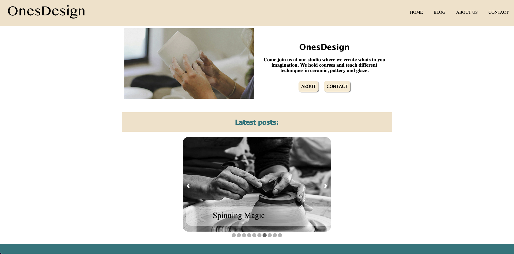

## Project Exam1 / OnesDesign



A blogsite for a ceramic studio run by OnesDesign, fetching posts from Wordpress API.

## Description

We have been tasked with creating a blog site. We could choose the design and topics covered on the blog, but it should have at least the following pages:

- Home page
- About page
- List of blog posts
- Blog post specific pages
- Contact page.

The criterias are to have a featured section with posts in a carousel. A load more button when a certain abount of blogposts are displayed on the blogpage. A blog detailed page with images with modal.

- Minimalistic and scandinavian design
- Earthy color pallette
- 12 blogposts

All images and text are chosen by me. Images from Unsplash.com

## Built With

- [Figma](https://www.figma.com)
- HTML
- CSS
- Javascript

## Getting Started

### Installing

1. Clone the repo:

```bash
git clone git@github.com:Noroff-FEU-Assignments/project-exam-1-KineOnes.git
```

2. View on Netlify
   [Netlify](https://celadon-pithivier-057384.netlify.app/)

### Running

Clone the repo, open in Vscode. Right click on the index.html and open in Live Server.

## Contributing

Open a pull request and review the code.

## Contact

[My Behance Profile](https://www.behance.net/kineonesv)

[My Github Profile](https://github.com/KineOnes)
